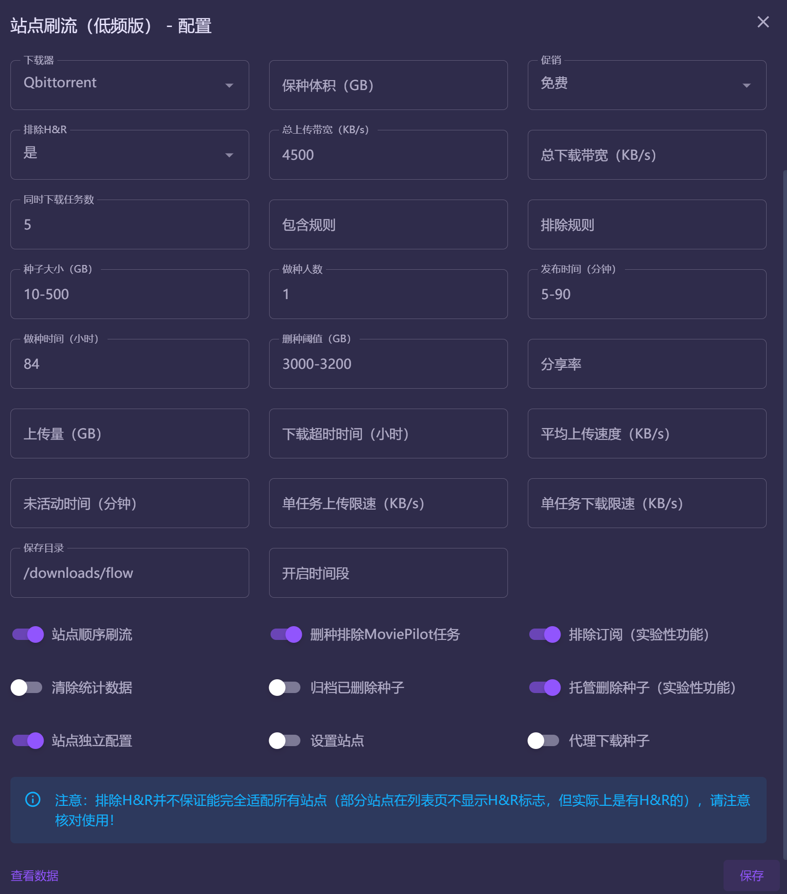
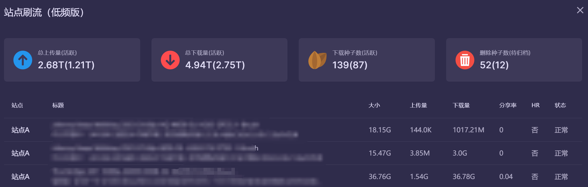

# MoviePilot-Plugins
MoviePilot三方插件：https://github.com/InfinityPacer/MoviePilot-Plugins

## 安装说明
MoviePilot环境变量添加本项目地址，具体参见 https://github.com/jxxghp/MoviePilot

## 插件说明

### 1. 站点刷流（低频版）
基于官方brushflow插件进行开发，相关调整
  - [x] 降低请求站点种子频率
  - [x] 优化某站UTC+0问题
  - [x] 支持删种排除MP标签
  - [x] 优化手工删种时更新统计的问题
  - [x] 支持种子筛选时支持种子副标题
  - [x] 支持种子筛选时自动过滤订阅内容标题
  - [x] 优化日志记录
  - [x] 重构刷流后台服务
  - [x] 支持没有勾选站点时能够继续刷流检查删种
  - [x] 重构刷流配置逻辑
  - [x] 增加顺序站点刷流配置，不开启时多站点刷流时随机站点刷流，避免多站点刷流时固定刷某站点，进一步降低无效的请求，如开启则按选择的站点顺序进行刷流
  - [x] 支持配置种子代理站点，解决下载器无法连接站点导致下载种子失败，无法获取Hash的问题
  - [x] 支持部分规则按站点配置（如hr，做种时间）
  - [x] 优化数据页显示，支持显示种子副标题
  - [x] 支持归档已删除种子，增加活跃、待归档种子统计
  - [x] 刷流消息通知支持显示副标题
  - [x] 支持统计手工刷流种子（仅qb）
  - [x] 支持配置刷流服务开启时间段
  - [x] 清除统计数据调整为清理已删除和已归档的数据，保留活跃种子数据
  - [ ] 刷流辅种删除优化，如果其他站点在辅种且不满足删种条件，则跳过
  - [x] 支持托管删除种子，当设置了托管删种（全局）和删除阈值时，当保种体积达到删除阈值时，优先按设置规则进行删除，若还没有达到阈值，则排除HR种子后按加入时间倒序进行删除
    - 删除阈值：100，当保种体积 > 100G 时，则开始删除种子，直至降低至 100G
    - 删除阈值：50-100，当保种体积 > 100G 时，则开始删除种子，直至降至为 50G

  
  
  
  #### 站点独立配置

  目前站点独立配置支持以下配置项，配置格式为json，通过sitename进行匹配，没有找到对应配置项时，则以全局配置项为准

  - `sitename`: 站点名称
  - `freeleech`: 促销
    - `''`: 全部（包括普通）
    - `'free'`: 免费
    - `'2xfree'`: 2X免费
  - `hr`: 排除H&R
    - `'yes'`: 是
    - `'no'`: 否
  - `include`: 包含规则
  - `exclude`: 排除规则
  - `size`: 种子大小
  - `seeder`: 做种人数
  - `pubtime`: 发布时间
  - `seed_time`: 做种时间
  - `seed_ratio`: 分享率
  - `seed_size`: 上传量
  - `download_time`: 下载超时时间
  - `seed_avgspeed`: 平均上传速度
  - `seed_inactivetime`: 未活动时间
  - `save_path`: 保存目录
  - `proxy_download`: 代理下载种子
  - `proxy_delete`: 托管删除种子（实验性功能）
  
  配置示例

  ```json
  [{
      "sitename": "站点1",
      "freeleech": "free",
      "hr": "no",
      "include": "",
      "exclude": "",
      "size": "10-500",
      "seeder": "1",
      "pubtime": "5-120",
      "seed_time": 120,
      "seed_ratio": "",
      "seed_size": "",
      "download_time": "",
      "seed_avgspeed": "",
      "seed_inactivetime": "",
      "save_path": "/downloads/site1",
      "proxy_download": false,
      "proxy_delete": false
  }, {
      "sitename": "站点2",
      "hr": "yes",
      "size": "10-500",
      "seeder": "5-10",
      "pubtime": "5-120",
      "seed_time": 96,
      "save_path": "/downloads/site2",
      "proxy_download": true
  }]
  ```  


