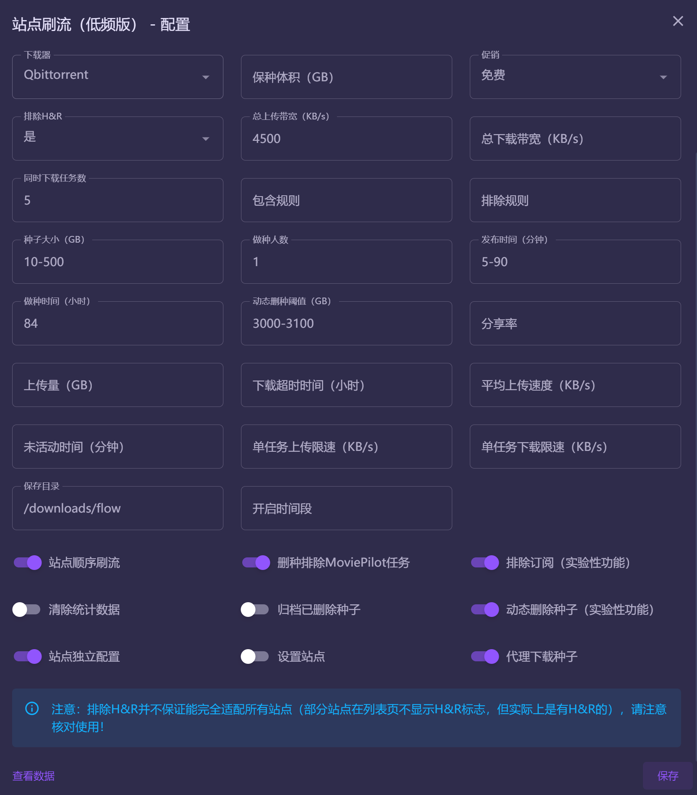

# MoviePilot-Plugins
MoviePilot三方插件：https://github.com/InfinityPacer/MoviePilot-Plugins

## 安装说明
MoviePilot环境变量添加本项目地址，具体参见 https://github.com/jxxghp/MoviePilot

## 插件说明

### 1. 站点刷流（低频版）

  在官方刷流插件的基础上，新增了若干项功能优化了部分细节逻辑，目前已逐步PR至官方插件。在此，再次感谢 @jxxghp 提供那么优秀的开源作品。

  #### 版本更新日志

  - v2.4.1
    - 部分站点刷流下载种子策略调整，避免刷流下载失败
    - 手工刷流同步tracker映射站点策略调整，避免映射失败导致统计异常的问题
 
  - v2.4 
    - 数据页增加做种时间列
    - 动态删除种子规则调整：优先删除满足用户设置删除规则的**全部种子**，**出于上传资源的考虑，即便在删除过程中已经低于了阈值下限，也会继续删除**，若删除后还没有达到阈值，则在完成种子中排除HR种子后按~~加入时间正序~~**做种时间倒序**进行删除
    - 修复增加MP标签后，提示种子被删除的问题
    - 日志进一步优化可读性

  #### 开发计划

  - [ ] **刷流辅种删除优化**：如果其他站点在辅种且不满足删种条件，则跳过
  - [ ] **HR种子删除优化**：增加H&R做种时间配置项，当配置了HR做种时间/分享率时，则HR种子只有达到预期行为时，才会进行删除，如果没有配置H&R做种时间/分享率，则普通种子的删除规则也适用于H&R种子
    - 请注意，H&R并不保证能完全适配所有站点（部分站点在列表页不显示H&R标志，但实际上是有H&R的），请注意核对使用

  #### 新增功能

  - [x] **记录更多日志**：开启开关后，日志中会记录更多刷流日志，以便更好决策刷流条件 (v2.2)
  - [x] **双向同步官方插件数据**：一次性将本插件与官方插件的数据进行同步，如遇重复项，已本插件的数据为准 (v2.1)
  - [x] **动态删除种子**（实验性功能）：当做种体积超过设定的动态删除阈值时，自动执行种子删除规则，优化存储管理 (v2.0)
    - 种子删除规则：优先删除满足用户设置删除规则的**全部种子**，**出于上传资源的考虑，即便在删除过程中已经低于了阈值下限，也会继续删除**，若删除后还没有达到阈值，则在已完成种子中排除HR种子后按~~加入时间正序~~**做种时间倒序**进行删除
    - 动态删除阈值：100，当做种体积 > 100G 时，则开始删除种子，直至降低至 100G
    - 动态删除阈值：50-100，当做种体积 > 100G 时，则开始删除种子，直至降至为 50G
  - [x] **刷流服务时间控制**：可配置刷流服务的开启时间段，不在时间范围内时自动跳过定时任务 (v1.9)
  - [x] **手工刷流种子自动管理（qb）**：下载器中手工下载的种子，在增加/删除刷流标签后，自动纳入/排除刷流管理 (v1.8)
  - [x] **种子数据管理**：支持归档已删除种子，并在数据页中展示活跃及归档种子统计 (v1.7)
  - [x] **站点独立配置**：部分规则（如hr，做种时间）现支持按站点独立配置，具体详情见[站点独立配置](#站点独立配置) (v1.7)
  - [x] **代理下载支持**：通过MP代理下载种子后推送下载器，解决下载种子失败问题 (v1.6)
  - [x] **站点顺序刷流**：支持配置是否按照选择的站点顺序进行刷流，或者在多站点刷流时随机选择站点刷流，避免固定刷某站点，进一步降低无效请求 (v1.6)
  - [x] **刷流检查定时任务**：无需勾选站点也支持定时任务正常执行刷流检查和删种操作 (v1.5)
  - [x] **排除订阅内容**（实验性功能）：自动过滤订阅内容标题，简化刷流筛选过程 (v1.5)
  - [x] **刷流筛选增强**：支持种子副标题包含/排除匹配规则，使刷流筛选更加精准 (v1.5)
  - [x] **下载器种子删除与刷流管理同步**：种子删除时，若已纳入刷流管理，则同步更新刷流列表，确保信息的一致性 (v1.4)
  - [x] **删种排除规则调整**：下载器配置MP标签后，删种检查过程中将自动排除处理MoviePilot任务，减少不必要的操作干扰 (v1.4)

  #### 优化项

  - [x] **做种体积判断优化**：调整做种体积判断策略，除前置判断外，筛选种子时优化判断 (v2.2)
  - [x] **清除统计数据调整**：调整数据清理策略，只清理已删除和已归档数据，保留活跃种子信息 (v1.9)
  - [x] **刷流消息通知**：通知消息中加入副标题显示，提供更完整的信息 (v1.8)
  - [x] **数据页显示改进**：数据页现支持显示种子副标题，增强信息的可读性 (v1.7)
  - [x] **后台服务与配置逻辑重构**：通过重构刷流后台服务和配置逻辑，进一步降低请求频率和提高配置灵活性 (v1.6)
  - [x] **日志记录优化**：部分日志记录调整优化 (v1.5)
  - [x] **时区问题修正**：修正部分站点时区为UTC+0导致的发布时间不匹配问题 (v1.4)
  - [x] **前置过滤条件判断优化**：刷流时，优先判断前置过滤条件，以降低对站点的请求频率 (v1.4)

  ##### 站点独立配置

  目前站点独立配置支持以下配置项，配置格式为json，通过sitename进行匹配，没有找到对应配置项时，则以全局配置项为准，**请注意，如与全局保持一致的配置项，请勿在站点配置中配置，此外hr配置项为排除H&R，请按下述内容进行配置，配置完成后，请在日志查看是否配置成功**，可打开**记录更多日志**配置项以便更好排查问题。

  - `sitename`: 站点名称
  - `freeleech`: 促销
    - `''`: 全部（包括普通）
    - `'free'`: 免费
    - `'2xfree'`: 2X免费
  - `hr`: 排除H&R
    - `'yes'`: 是
    - `'no'`: 否
  - `include`: 包含规则
  - `exclude`: 排除规则
  - `size`: 种子大小
  - `seeder`: 做种人数
  - `pubtime`: 发布时间
  - `seed_time`: 做种时间
  - `seed_ratio`: 分享率
  - `seed_size`: 上传量
  - `download_time`: 下载超时时间
  - `seed_avgspeed`: 平均上传速度
  - `seed_inactivetime`: 未活动时间
  - `save_path`: 保存目录
  - `proxy_download`: 代理下载种子
  - `proxy_delete`: 动态删除种子（实验性功能）
  
  配置示例

  ```json
  [{
    "sitename": "站点1",
    "seed_time": 96
  }, {
      "sitename": "站点2",
      "hr": "yes",
      "size": "10-500",
      "seeder": "5-10",
      "pubtime": "5-120",
      "seed_time": 96,
      "save_path": "/downloads/site2",
      "proxy_download": true
  }, {
      "sitename": "站点3",
      "freeleech": "free",
      "hr": "no",
      "include": "",
      "exclude": "",
      "size": "10-500",
      "seeder": "1",
      "pubtime": "5-120",
      "seed_time": 120,
      "seed_ratio": "",
      "seed_size": "",
      "download_time": "",
      "seed_avgspeed": "",
      "seed_inactivetime": "",
      "save_path": "/downloads/site1",
      "proxy_download": false,
      "proxy_delete": false
  }]
  ```  

  
  


